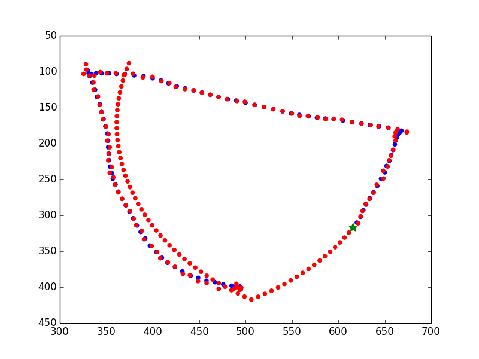
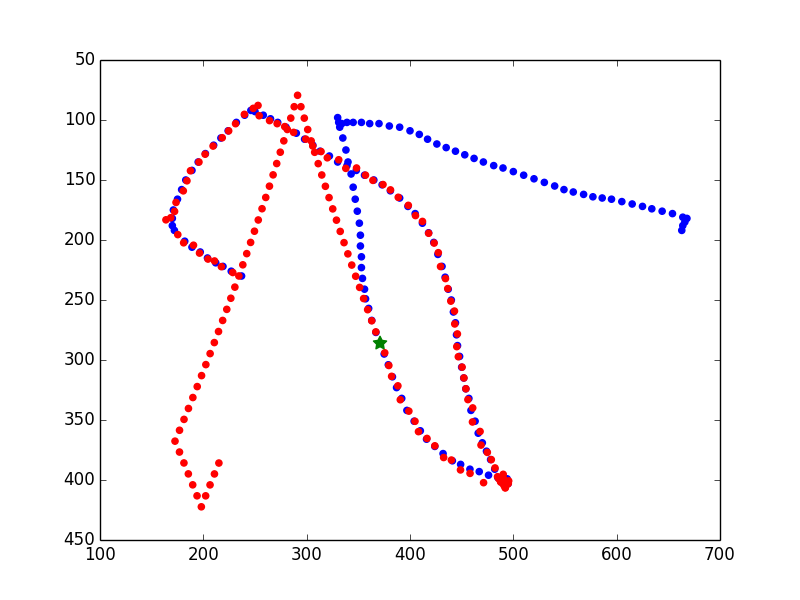
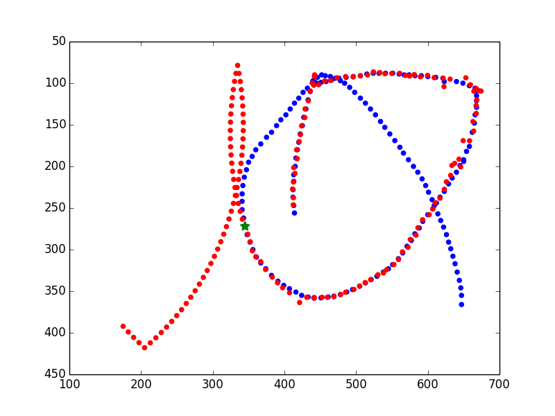
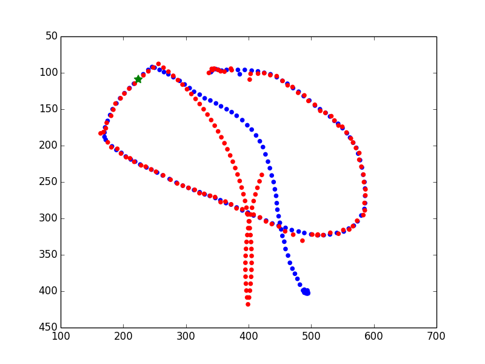

# HexBug Tracker
>__CS8803 Artificial Intelligence for Robotics__  
>__Summer 2014__  
>__Author: William Clay Flannigan__  
>__GTID: 903055887__  

## Files
* `HexBug_Flannigan.py` - the HexBug Python program
* `readme.md` - this file
* `testing_video-centroid_data` - the test input file
* `*.png` - sample output plots

## Description
The HexBug tracker program takes an input file of centroid data, extracted from a video, and then predicts the motion of the HexBug 63 frames beyond the end of the input data.

## Usage
The Python program requires the input file as an argument:
> `python HexBug_Flannigan.py <input_file_name>`

For example:
> `python HexBug_Flannigan.py testing_video-centroid_dat`

## Dependencies
The program has been tested on Python 2.7.8 with NumPy 1.8.1 and matplotlib 1.3.1.

## Theory of Operation
__Data Filtering__  
The program starts by reading in the input file and then filters this data to remove outliers.  Specifically, it interpolates data that is invalid (centroid of [-1,-1]) or with velocities greater than physically possible, as defined by the constant `MAXVEL`.  This filtering process ensures reasonably consistent and smooth input data.

__Measured State Calculation__  
The motion model requires an estimate of the linear and angular velocity along with the heading of the HexBug.  These state variables are calculated from differential readings (numerical differentiation) of the x, y position values.

__Wall Location Calculation__  
The motion model is a hybrid model of a constant velocity object and a wall impact model.  For the wall model, the application must estimate the location of the walls from the HexBug motion.  It does this by sorting the data and using percentiles to define the x and y values of the walls.  Using percentiles helps make the estimate more robust to outliers.  The percentile is defined by the constant `WALLPERCENTILE` which is set to 1%.

__Motion Model__  
The motion model assumes constant linear and angular velocity in regions away from the walls.  At a wall, an impact model is assumed that modifies the heading of the HexBug to be the opposite of in angle of incidence.  This is a "pool ball" model assuming a perfectly symmetric entrance and exit angle.  The constant velocity regime is calculated in the `movementFunction` and the wall impact is added in `estimateNextPos`.

__State Estimation__  
To predict the motion model forward beyond the input data, we must have an estimate of the state of the robot at the end of the provided data.  This is accomplished by running an Extended Kalman Filter through the data file to generate the state estimate.  The filter is initialized and called by the function `estimateNextPosEKF`.  The extended filter was chosen because of the non-linear nature of the HexBug motion.

__Prediction__  
Given the state estimate at the last input point, the motion model may be then used to predict forward in time the state of the HexBug.  This approach is slightly modified, by limiting the maximum value of the angular velocity estimate since this state variable tends to be noisy due to the numerical differentiation.  The state estimation and subsequent prediction is handled by the function `tracker`.

__Output__  
After making the prediction, the measured and predicted data are plotted and the L^2 error is calculated if predictions are made in the bounds of the input data.  If the prediction is beyond the input data, the result is printed to the screen and to the file "predictions.csv".  Note that the constant `NUMRUNS` controls whether predictions are made in the middle of the input file (`NUMRUNS > 1`) or after the end of the input data (`NUMRUNS == 1`).

## Input File Format
The input file is assumed to be valid JSON array in a text file.

## Output File Format
The output file is "predictions.csv" and is a comma separated value file of the 63 x, y predictions.

## Results
The motion of the HexBug is highly stochastic.  The motion model makes simplifying assumptions that are often not valid.  Specifically, the model assumes constant velocity (linear and angular) and well behaved wall impacts.  In practice, these are not great assumptions.  The constant velocity assumption is reasonably accurate, but the HexBug is often seen changing its heading in unpredictable ways.  The wall impacts are even more problematic.  The motion after wall impact is highly stochastic, and is not easily predictable from a simple physics model.  

By setting the `NUMRUNS` constant to 20 on the test input file, the average L^2 error is 1256.  The instructors have reported that a random solution produces an error of at best 2100, so the solution is better than random, but still produces divergent results.

Below are some examples.  The images show in blue the measured value and in red the predicted value.  The green star indicates where predictions start without measurements.  100 plot points are shown before the 63 predicted points.

